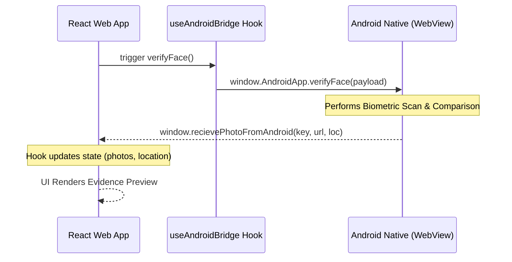

# FieldBridge v2.0 - Android Web Bridge Documentation

This project provides a robust interface between a React web application and a native Android container via a WebView bridge.

## New Feature: Face Verification

The **Verify Face** feature allows the application to perform biometric validation by sending face embeddings to the Android native layer.

### Native Interface
- **Method**: `window.AndroidApp.verifyFace(jsonPayload)`
- **Payload Structure**:
  ```json
  {
    "returnKey": "face_verification",
    "faceEmbeddings": {
      "size": 3,
      "data": [
        [...512 floats...],
        [...512 floats...],
        [...512 floats...]
      ]
    },
    "waterMark": {
      "geoLocation": true,
      "accuracy": true,
      "accuracyLimit": 50,
      "staticDatas": [
        { "key": "type", "value": "face_verification" },
        { "key": "timestamp", "value": "..." }
      ]
    }
  }
  ```

### Workflow Diagram



## Integration Details

### Custom Hook: `useAndroidBridge`
The application logic is centralized in a custom hook located at `src/hooks/useAndroidBridge.js`. This hook manages state and registers global callbacks.

### Global Callbacks
1. `recievePhotoFromAndroid(returnKey, photoUrl, location)`: Used for both standard photos and face verification results.
2. `recieveLiveLocationFromAndroid(location)`: Used for periodic location synchronization.
